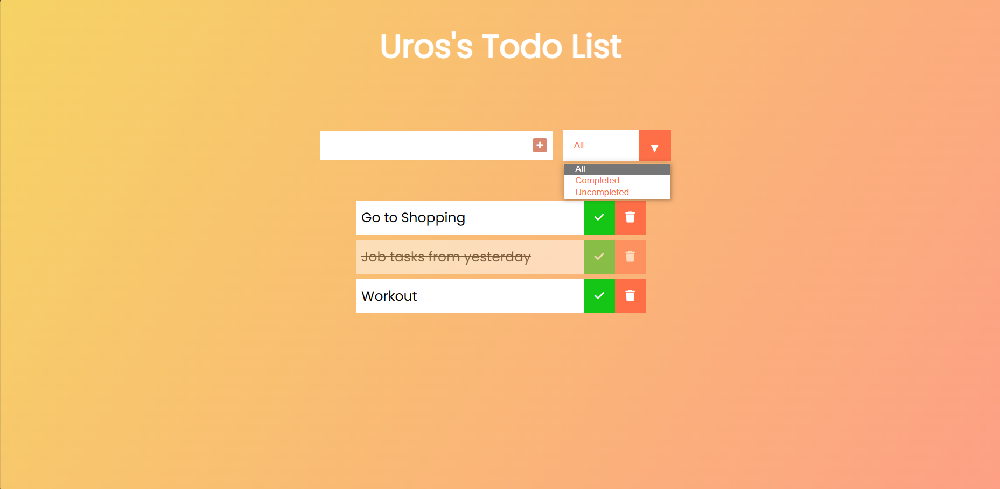

# todolist
ToDo List

The ToDo List is an application that enables users to add, edit, and mark tasks as completed or unfinished. 
Users can filter the displayed content based on all tasks, completed tasks, or those not marked as completed. This application is developed using HTML, CSS, SASS, and JavaScript.

Features

Adding Tasks :
Users can add new tasks by entering text and appending new elements to the task list.

Editing Tasks
There are options to edit existing tasks to modify the task text or details.

Task Marking
Users can mark tasks as completed or unfinished using checkboxes next to each task.

Filters
All Tasks: Displays all added tasks.
Completed Tasks: Shows only completed tasks.
Unfinished Tasks: Displays tasks that are not marked as completed.
Deleting Tasks
Deleting tasks from the list is enabled.

Installation
Clone this repository to your local machine using git clone.
Open the index.html file in a web browser.
How to Use
Add a new task by entering text in the input field and clicking the "Add" button.
Mark tasks as completed or unfinished by clicking the checkbox next to each task.
Edit tasks by clicking the respective edit button.
Utilize the filters to view specific task groups (all, completed, unfinished).
Delete tasks by clicking the delete button.
